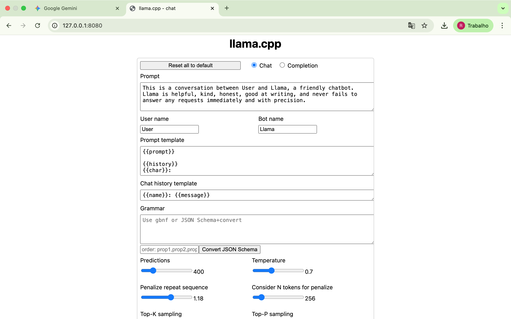
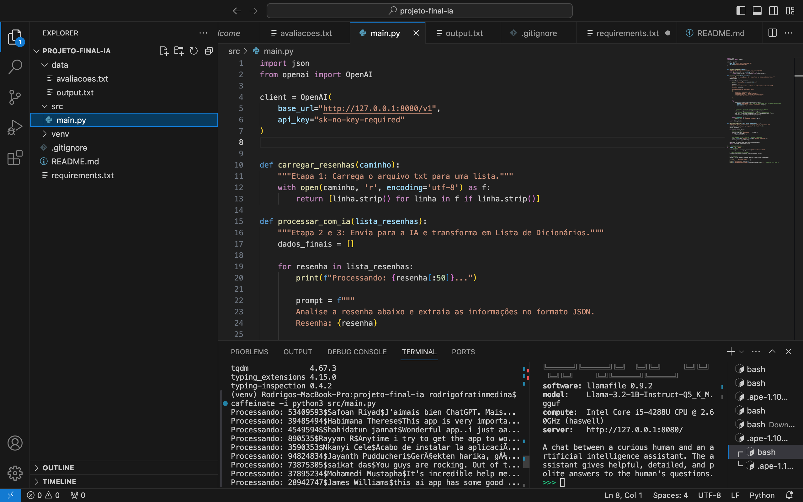
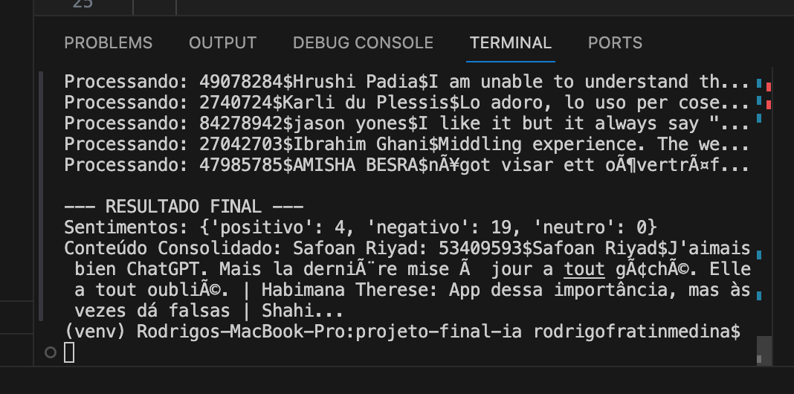

# Pipeline de Análise de Sentimentos com LLM Local

Este projeto foi o desafio final da minha formação em Python para IA. Ele consiste em um pipeline que processa resenhas de aplicativos em múltiplos idiomas, realiza a tradução e classifica o sentimento de cada uma utilizando uma IA local.

## 🚀 Diferenciais Técnicos
- **Inferência Local**: Configurado para rodar em hardware legado (MacBook Pro 2013) utilizando modelos quantizados.
- **Arquitetura Desacoplada**: Uso de servidor de inferência (Llamafile) separado da lógica de aplicação (Python).
- **Processamento Estruturado**: Garantia de saída em formato JSON para integração com sistemas de dados.

## 🛠️ Tecnologias
- **Python 3.13**
- **OpenAI API Library** (para comunicação com servidor local)
- **Llama 3.2 1B Instruct** (via Llamafile)
- **Venv** (Ambiente virtual para gestão de dependências)

## 📊 Como funciona
1. O script lê um arquivo `.txt` com resenhas brutas.
2. Cada resenha é enviada para a LLM local com um prompt de sistema rigoroso.
3. A IA retorna um JSON com: usuário, texto original, tradução e sentimento.
4. O sistema consolida os dados e gera um relatório de contagem de sentimentos.